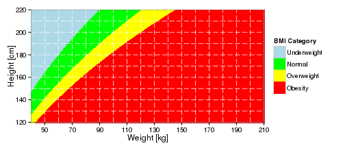

<style>
strong {
  font-weight: bold;
}
</style>


## About application
Application contains BMI and BMR calculators that allows you to check your Body Mass Index and Basal metabolic rate.

One can access an application using link:
https://przemekd.shinyapps.io/DDP_shinyApp/

---

## BMR and BMI Definition

**Basal metabolic rate (BMR)**, and the closely related resting metabolic rate (RMR), is the rate of energy expenditure by humans and other animals at rest, and is measured in kJ per hour per kg body mass.

**The body mass index (BMI)**, or Quetelet index, is a measure of relative weight based on an individual's mass and height.

--- .class #id

## BMI and BMR equations
There are two equation that are used to calculate outputs in this shinyApp.
Equation for calculating body mass index:

$$BMI = (\frac{mass}{height*height})\frac{kg}{m*m}$$

The Mifflin St Jeor Equation for calculating basal metabolic rate:

$$BMR = (\frac{10.0 m}{1 kg} + \frac{6.25 h}{1 cm} - \frac{5.0 a}{1 year} + s)\frac{kcal}{day}$$, where s is +5 for men and -161 for women

---

## BMI Plot
In the application a plot is use to visualize BMI category. This plot is recreated in this slide by using R code (not all code shown here).

```r
ww <- data.frame(x = c(wt,wt,wt,wt),
                 ymin = c(ht1,ht2,ht3,htmin),
                 ymax = c(htmax,ht1,ht2,ht3),
                 grp = rep(c('Underweight','Normal', 'Overweight', 'Obesity'),
                           each = 1000))
```




